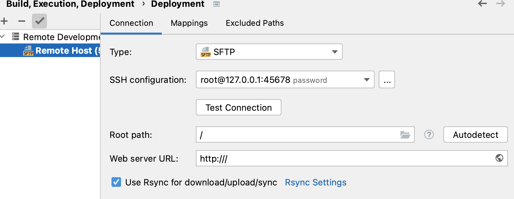
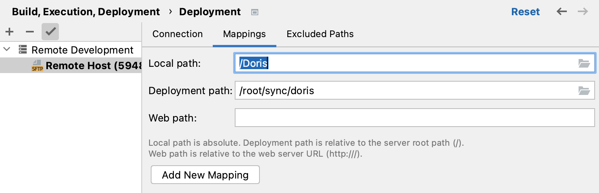
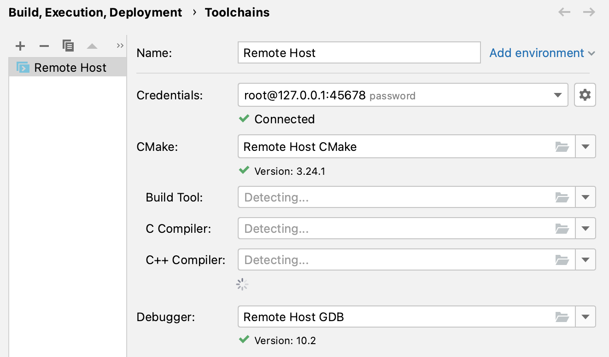

# doris-dev-arm64
The Doris of arm64 development environment by using docker.

Set up an environment for building source code of Doris and development when you want convenience such as code jumping、highlight、syntax check etc on the non-Linux machine.


## Requirements

- ubuntu:20.04/arm64
- Docker 4.12.0 (85629)
- Docker Compose: v2.10.2
- Clion
- Idea

## Set up

1. First of all, prepare a directory and write these files about docker-compose.

   - Dockerfile

   ```dockerfile
   # basic image
   FROM --platform=linux/arm64 ubuntu:20.04 
   # author information
   LABEL version="v1" maintainer="x"
   
   # boost version info
   ARG BOOST_VERSION=1.73.0
   ARG BOOST_VERSION_=1_73_0
   ENV BOOST_VERSION=${BOOST_VERSION}
   ENV BOOST_VERSION_=${BOOST_VERSION_}
   ENV BOOST_ROOT=/usr/include/boost
   # When installing tzData directly, you may need to manually select the time zone. Add this environment variable so that it is automatically selected without interaction
   ENV DEBIAN_FRONTEND=noninteractive
   # copy apt sources
   COPY sources.list /etc/apt/sources.list
   
   RUN apt-get update -y \
   && apt-get upgrade -y && apt-get install -y wget
   # Installing openssh and rsync that Clion can to remote deployment and connect to docker for develop.
   RUN apt install -y --no-install-recommends tzdata build-essential cmake gdb openssh-server rsync vim git
   
   
   # for doris (these parts refer to the compilation with Arm from the official website of Doris)
   ## mkdir
   RUN mkdir /opt/tools
   RUN mkdir /opt/software
   
   ## JDK8
   RUN cd /opt/tools
   RUN wget https://doris-thirdparty-repo.bj.bcebos.com/thirdparty/jdk-8u291-linux-aarch64.tar.gz && \
   tar -zxvf jdk-8u291-linux-aarch64.tar.gz && \
   mv jdk1.8.0_291 /opt/software/jdk8
   
   ## Maven
   RUN wget https://dlcdn.apache.org/maven/maven-3/3.6.3/binaries/apache-maven-3.6.3-bin.tar.gz && \
   tar -zxvf apache-maven-3.6.3-bin.tar.gz && \
   mv apache-maven-3.6.3 /opt/software/maven
   
   ## NodeJS
   RUN wget https://doris-thirdparty-repo.bj.bcebos.com/thirdparty/node-v16.3.0-linux-arm64.tar.xz && \
   tar -xvf node-v16.3.0-linux-arm64.tar.xz && \
   mv node-v16.3.0-linux-arm64 /opt/software/nodejs
   
   ## LDB-Toolchain
   wget https://github.com/amosbird/ldb_toolchain_gen/releases/download/v0.9.1/ldb_toolchain_gen.aarch64.sh && \
   sh ldb_toolchain_gen.aarch64.sh /opt/software/ldb_toolchain/
   
   ## autoconf
   RUN wget http://ftp.gnu.org/gnu/autoconf/autoconf-2.69.tar.gz && \
       tar zxf autoconf-2.69.tar.gz && \
       mv autoconf-2.69 /opt/software/autoconf && \
       cd /opt/software/autoconf && \
       ./configure && \
       make && \
       make install
   
   ## Configure environment variables
   RUN vim /etc/profile.d/doris.sh
   RUN echo export JAVA_HOME=/opt/software/jdk8
   RUN echo export MAVEN_HOME=/opt/software/maven
   RUN echo export NODE_JS_HOME=/opt/software/nodejs
   RUN echo export LDB_HOME=/opt/software/ldb_toolchain
   RUN echo export PATH=$JAVA_HOME/bin:$MAVEN_HOME/bin:$NODE_JS_HOME/bin:$LDB_HOME/bin:$PATH
   
   
   
   RUN apt install -y build-essential cmake flex automake bison binutils-dev libiberty-dev zip libncurses5-dev curl ninja-build
   RUN apt-get install -y make
   RUN apt-get install -y unzip
   RUN apt-get install -y python2
   RUN apt-get install -y byacc
   RUN apt-get install -y automake
   RUN apt-get install -y libtool
   RUN apt-get install -y bzip2
   RUN apt install -y autoconf autopoint libboost1.73-dev
   RUN apt install -y gcc-11 g++-11
   RUN ln -f -s /usr/bin/g++-11 /usr/bin/g++
   RUN ln -f -s /usr/bin/gcc-11 /usr/bin/gcc
   
   
   # for locales
   RUN apt-get update && apt-get install -y --no-install-recommends locales locales-all
   RUN sed -i '/en_US.UTF-8/s/^# //g' /etc/locale.gen && locale-gen
   ENV LANG en_US.UTF-8
   ENV LANGUAGE en_US:en
   ENV LC_ALL en_US.UTF-8
   
   # config sshd and rsnyc, allow root login, close usePAM, allow rsnyc
   RUN mkdir /var/run/sshd
   RUN sed -ri 's/^#PermitRootLogin\s+.*/PermitRootLogin yes/' /etc/ssh/sshd_config &&  sed -ri 's/UsePAM yes/#UsePAM yes/g' /etc/ssh/sshd_config && sed -ri 's/RSYNC_ENABLE=false/RSYNC_ENABLE=true/g' /etc/default/rsync
   
   # config rsync service
   COPY rsync.conf /etc
   # set password for user
   RUN echo 'root:xxx' |chpasswd
   RUN mkdir /root/sync
   
   # last step will start ssh and rsync service when docker-compse start
   COPY entrypoint.sh /sbin
   RUN chmod +x /sbin/entrypoint.sh
   ENTRYPOINT [ "/sbin/entrypoint.sh" ]
   
   ```

   

   - docker-compose.yml

   ```yaml
   version: "3"
   
   services:
     env:
       build: .
       container_name: doris-dev-arm64
       # Forward docker port 22 to host 45678 port 873 to 8730,873 for file synchronization
       ports:
         - "45678:22"
         - "8730:873"
       cap_add:
         - ALL
   ```

   

   - rsync.conf

   ```properties
   # config info
   max connections = 8
   log file = /var/log/rsync.log
   timeout = 300
   
   [sync] # module name
   comment = doris 
   # The path is folder that need synchronization for remote host
   path = /root/sync 
   read only = no
   list = yes
   uid = root
   gid = root
   ```

   

   - sources.list

   ```
   deb http://br.archive.ubuntu.com/ubuntu/ focal main restricted
   # deb-src http://br.archive.ubuntu.com/ubuntu/ focal main restricted
   
   deb http://br.archive.ubuntu.com/ubuntu/ focal-updates main restricted
   # deb-src http://br.archive.ubuntu.com/ubuntu/ focal-updates main restricted
   
   deb http://br.archive.ubuntu.com/ubuntu/ focal universe
   # deb-src http://br.archive.ubuntu.com/ubuntu/ focal universe
   deb http://br.archive.ubuntu.com/ubuntu/ focal-updates universe
   # deb-src http://br.archive.ubuntu.com/ubuntu/ focal-updates universe
   
   deb http://br.archive.ubuntu.com/ubuntu/ focal multiverse
   # deb-src http://br.archive.ubuntu.com/ubuntu/ focal multiverse
   deb http://br.archive.ubuntu.com/ubuntu/ focal-updates multiverse
   # deb-src http://br.archive.ubuntu.com/ubuntu/ focal-updates multiverse
   
   deb http://br.archive.ubuntu.com/ubuntu/ focal-backports main restricted universe multiverse
   # deb-src http://br.archive.ubuntu.com/ubuntu/ focal-backports main restricted universe multiverse
   
   deb http://security.ubuntu.com/ubuntu focal-security main restricted
   # deb-src http://security.ubuntu.com/ubuntu focal-security main restricted
   deb http://security.ubuntu.com/ubuntu focal-security universe
   # deb-src http://security.ubuntu.com/ubuntu focal-security universe
   deb http://security.ubuntu.com/ubuntu focal-security multiverse
   # deb-src http://security.ubuntu.com/ubuntu focal-security multiverse
   
   deb http://ppa.launchpad.net/ubuntu-toolchain-r/ppa/ubuntu focal main
   # deb-src http://ppa.launchpad.net/ubuntu-toolchain-r/ppa/ubuntu focal main
   
   ## This repository is because the version of boost installed(1.71) on ubuntu 20.04 is not satisfied require of the Doris, if you want to install boost manually, these lines can be removed.
   deb http://ppa.launchpad.net/mhier/libboost-latest/ubuntu focal main
   # deb-src http://ppa.launchpad.net/mhier/libboost-latest/ubuntu focal mai
   ```

   

   - entrypoint.sh

   ```shell
   #!/bin/bash
   
   /usr/bin/rsync --daemon --config=/etc/rsync.conf
   /usr/sbin/sshd -D
   ```


2. Build docker-compose

   ```
   docker build -t ubuntu:arm64 .
   ```

3. Run docker-comose

   ```
   docker-compose up -d
   ```

4. Config Clion

   - Deployment

     - Preferences->Build,Execution,Deployment->Deployment

     - Add Remote Host under Remote Development

     - Connection 

       ```shell
       Type -> SFTP
       SSH configuration -> connect to machine in Docker by ssh
       Root path-> /
       Web server URL: http:///
       ```

       - 

     - Mappings

       ```
       Local path-> path of the Doris
       Delopment path->/root/sync/doris
       ```

       

   - Toolchains	

     - Preferences->Build,Execution,Deployment->Toolchains

     - Add Remote Host

       ```
       Credentials-> select just configured
       CMake-> Remot Host CMake
       Debugger-> Remote Host GDB
       ```

       

6. Refresh in CMake panel and observe information


**Reference**

- Doris official document -> https://doris.apache.org/docs/install/source-install/compilation-arm
- Clion Docker toolchain guidance document -> https://www.jetbrains.com/help/clion/clion-toolchains-in-docker.html#old-approach

- Using Docker with Clion guidance document -> https://blog.jetbrains.com/clion/2020/01/using-docker-with-clion/

